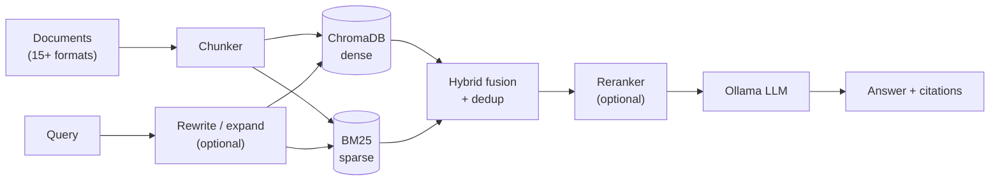

# Retrieval System

A local-first RAG engine that combines dense + BM25 hybrid retrieval, optional reranking and LLM query rewriting, and grounded citation-backed generation — with a built-in evaluation and hyperparameter-tuning harness, served over a CLI, FastAPI, and Gradio UI.

[](https://github.com/ihnatenko-oleksii/Retrieval-System/actions/workflows/ci.yml)

## Key capabilities

- **15+ ingestible formats** — `.txt`, `.md`, `.pdf`, `.docx`, `.pptx`, `.csv`, `.json`, and source code (`.py`, `.java`, `.js`, `.ts`, `.yml`, `.yaml`, `.xml`, `.properties`), recursively, with per-chunk metadata.
- **Hybrid dense + BM25 retrieval** — ChromaDB dense vectors and a BM25 lexical index, independently score-normalized and fused with configurable weights.
- **Reranking** — optional cross-encoder second-pass scoring, with a safe fallback to the hybrid order if the model is unavailable.
- **Query rewriting & expansion** — optional LLM-driven query clarification, conversational follow-up rewriting, and multi-phrasing expansion.
- **Grounded generation with citations** — answers are built strictly from retrieved context, with numbered inline citations back to source file, chunk, and score.
- **Evaluation & tuning built in** — Recall@K, Precision@K, MRR, nDCG, and keyword hit rate, plus a Gradio sweep UI that ranks hyperparameter combinations by a composite score.
- **Three interfaces** — CLI, FastAPI, and Gradio, all sharing the same retrieval/generation core.
- **Local-first** — persistent on-disk indexes, runs entirely against a local Ollama model; no data leaves the machine.

## Architecture



CLI, FastAPI, and Gradio all drive the same pipeline. Full breakdown, including how score fusion, deduplication, and evaluation work, in [docs/architecture.md](docs/architecture.md).

## Benchmark

`scripts/benchmark.py` runs a reproducible A/B/C comparison — **dense-only** vs **hybrid (dense + BM25)** vs **hybrid + reranking** — against a fixed sample corpus and eval set, reporting Recall@K, Precision@K, MRR, nDCG, and keyword hit rate.

**No benchmark numbers are published here** — running it requires downloading the embedding model and, for keyword hit rate, a local Ollama install, neither of which this repository assumes you have yet. See [docs/benchmark.md](docs/benchmark.md) for the exact one-command run, the methodology, and why fabricated numbers aren't an acceptable substitute for real ones.

## Technical highlights

- Hybrid fusion dedups on a stable `(file_path, chunk_index)` chunk identity, not raw text — two unrelated chunks with similar wording no longer silently collapse into one result.
- nDCG is computed correctly for multiple relevant chunks per query (the ideal ranking is derived from the chunks actually found, not a hardcoded constant that let the metric exceed 1.0).
- FastAPI dependency injection with lazy, `lru_cache`d singletons — importing the API module never triggers a model download, and tests swap in fakes via `dependency_overrides`.
- 113 tests / ~92% coverage on core logic (retrieval, fusion, reranking, rewriting, evaluation, ingestion, API), all offline — no network or GPU required to run the suite.
- Ruff-linted and formatted, with GitHub Actions CI running lint + tests + coverage on every push/PR.

## Screenshot


## Quick start

Requires Python 3.12+, [uv](https://docs.astral.sh/uv/), and [Ollama](https://ollama.com/) running locally.

```bash
uv sync
ollama pull llama3.2

# put your documents in ./data, then:
uv run main.py ingest "./data"
uv run main.py ask "What is OOP?"
uv run main.py ui
```

## Learn more

- [docs/usage.md](docs/usage.md) — full CLI/API reference, `.env` configuration, eval file format
- [docs/workflow.md](docs/workflow.md) — recommended data-prep → ingest → eval → tune workflow
- [docs/architecture.md](docs/architecture.md) — request flow, score fusion, evaluation internals
- [docs/benchmark.md](docs/benchmark.md) — reproducible retrieval benchmark
- [docs/troubleshooting.md](docs/troubleshooting.md) — common issues

This codebase is structured to be extended toward stronger production usage (richer evals, auth, observability, etc.) — see [Extending the system](docs/usage.md#extending-the-system).
