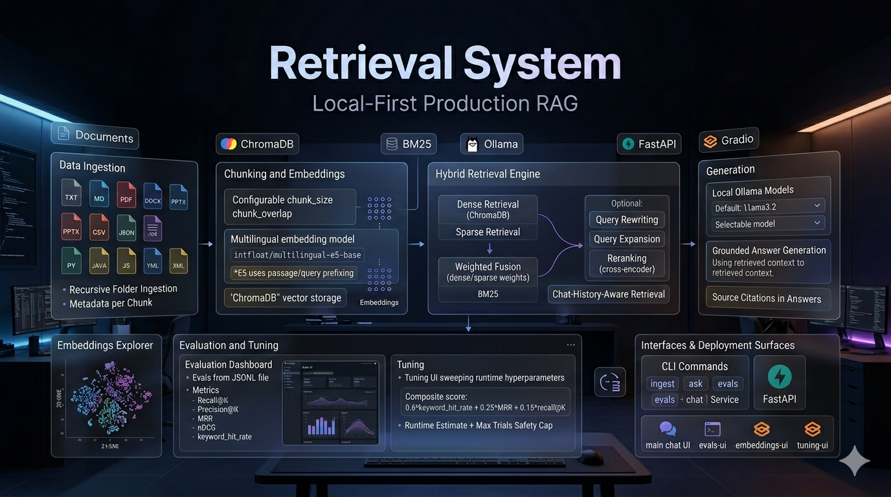

# Retrieval System (Local-First Production RAG)

A modular, local-first RAG application in Python that supports:
- multi-format ingestion
- dense + lexical hybrid retrieval
- optional query rewriting/expansion
- optional reranking
- grounded answer generation with citations
- CLI, FastAPI, and Gradio UI

This project is designed for practical local use with `Ollama` and persistent local storage.

## What This README Contains

- [Features](#features)
- [Project Structure](#project-structure)
- [Requirements](#requirements)
- [Prompt For Your Code Agent](#prompt-for-your-code-agent)
- [Quick Start](#quick-start)
- [Recommended Workflow (Best Quality)](#recommended-workflow-best-quality)
- [CLI Usage](#cli-usage)
- [FastAPI Endpoints](#fastapi-endpoints)
- [Configuration (`.env`)](#configuration-env)
- [Evaluation File Format (JSONL)](#evaluation-file-format-jsonl)
- [How Retrieval Works](#how-retrieval-works)
- [Troubleshooting](#troubleshooting)
- [Extending The System](#extending-the-system)
- [Notes](#notes)

## Features

- Ingest and index:
  - `.txt`, `.md`
  - `.pdf`
  - `.docx`
  - `.pptx`
  - `.csv`
  - `.json`
  - source code files (`.py`, `.java`, `.js`, `.ts`, `.yml`, `.yaml`, `.xml`, `.properties`)
- Recursive folder ingestion with metadata per chunk
- Configurable chunking (`chunk_size`, `chunk_overlap`)
- Dense retrieval (`ChromaDB` + `sentence-transformers`)
- Sparse retrieval (`BM25`) and hybrid score fusion
- Query rewriting and query expansion switches
- Optional reranking (cross-encoder)
- Conversational RAG (chat history aware)
- Evaluation pipeline (`Recall@K`, `Precision@K`, `MRR`, `nDCG`, keyword hit rate)
- Interfaces:
  - CLI
  - FastAPI
  - Gradio web UI

## Project Structure

```text
app/
  api/           # FastAPI endpoints
  chunking/      # Chunk splitting logic
  core/          # Config + shared data models
  embeddings/    # Embedding adapters
  evals/         # Evaluation pipeline
  generation/    # LLM prompting and answer generation
  ingestion/     # File loaders and ingestion pipeline
  retrieval/     # Retriever, rewriter, reranker
  ui/            # Gradio application
  vector_store/  # Chroma + BM25 stores
data/            # Put your source documents here
storage/         # Persistent indexes (Chroma + BM25)
main.py          # CLI entrypoint
```

## Requirements

- Python `3.12+`
- [uv](https://docs.astral.sh/uv/)
- [Ollama](https://ollama.com/) installed and running locally
- One local Ollama model pulled (default: `llama3.2`)

## Prompt For Your Code Agent

Before running this prompt:
- put your source files (files for RAG) into the `data/` directory
- run your code agent in this repository root

Use this prompt:

```text
Set up and run this Retrieval System project end-to-end.

Follow these steps exactly:
1) Install dependencies:
   - Run: uv sync
2) Ensure Ollama model is available:
   - Run: ollama pull llama3.2
3) Ingest documents from ./data:
   - Run: uv run main.py ingest "./data"
4) Run a quick sanity question:
   - Run: uv run main.py ask "What is OOP?"
5) Launch the main UI:
   - Run: uv run main.py ui

After each step, report success/failure and the key output.
If a step fails, diagnose and fix it before continuing.
```

## Quick Start

### 1) Install dependencies

```bash
uv sync
```

### 2) Start Ollama and pull a model

```bash
ollama pull llama3.2
```

### 3) Prepare data for better RAG (recommended)

RAG quality depends heavily on source quality. Before ingestion, clean and normalize your data:
- keep one topic per chunk-sized section
- remove duplicates and outdated versions
- expand acronyms on first use
- use clear headings and stable document titles
- keep important facts close to the heading that names them

Short prompt for data preparation:

```text
Rewrite the text to be RAG-ready: keep all facts, remove fluff, expand acronyms once, use clear headings, split into short semantically complete sections, and output clean markdown.
```

### 4) Ingest your documents
Put your source documents in `./data`.

```bash
uv run main.py ingest "./data"
```

### 5) Ask a question

```bash
uv run main.py ask "What is OOP?"
```

## Recommended Workflow (Best Quality)

Your 5-step flow is mostly correct. This is the best-practice version:

1) Preprocess your source data for RAG
- Yes, this is a good idea and usually gives a big quality boost.
- Goal: clean structure, consistent terminology, and chunk-friendly sections.
- Prefer running this on a local/private LLM if documents are sensitive.

Suggested prompt:

```text
Rewrite this document to be RAG-ready in Markdown.
Rules:
- Keep all factual information (do not invent or remove facts).
- Use clear section headings and short, self-contained paragraphs.
- Expand acronyms on first use: "ACRONYM (full name)".
- Remove boilerplate, duplicated lines, and irrelevant fluff.
- Keep critical entities exact: IDs, URLs, versions, statuses, enum values.
- If a section mixes topics, split it into separate sections.
Return only the improved Markdown.
```

2) Ingest your prepared data

```bash
uv run main.py ingest "./data"
```

3) Create `evals-json.jsonl`
- Also a good step, but do not blindly trust generated evals.
- Use another LLM to draft cases, then manually review them.
- Include edge cases and negative cases, and avoid only easy glossary questions.

Suggested prompt:

```text
You are creating an evaluation dataset for a RAG system.
Given the documents, generate JSONL lines with schema:
{"question":"...","expected_keywords":["..."],"expected_source":"..."}

Requirements:
- Create diverse questions: definitions, process steps, URLs, statuses, technical details.
- Include both easy and hard questions.
- expected_source must be the exact relative source path/file used in the corpus.
- expected_keywords should contain key terms that must appear in a correct answer.
- Keep questions unambiguous and answerable from one or few sources.
- Output only valid JSONL (one JSON object per line, no markdown).
Produce at least 30-100 cases depending on corpus size.
```

4) Run hyperparameter tuning

```bash
uv run main.py tuning-ui
```

Use tuning to optimize retrieval/runtime knobs (`top_k`, hybrid dense/sparse weight, reranker, query rewriting, query expansion, model).

5) Apply the best config in production chat UI

```bash
uv run main.py ui
```

Then set the same best values in the sidebar controls and use them for real Q&A.

## CLI Usage

Show command help:

```bash
uv run main.py --help
```

### Command Reference (each command)

- `ingest` - Parse documents, chunk them, and build Chroma + BM25 indexes.
  ```bash
  uv run main.py ingest "./data"
  ```

- `ask` - Run one-shot QA from terminal.
  ```bash
  uv run main.py ask "What is SOLID?" --top-k 5 --model llama3.2
  ```

- `chat` - Interactive terminal chat mode (type `exit`/`quit` to stop).
  ```bash
  uv run main.py chat
  ```

- `evals` - Run JSONL evaluation in terminal and print metrics.
  ```bash
  uv run main.py evals "./evals-json.jsonl" --top-k 5
  ```

- `ui` - Main Gradio chat UI for day-to-day usage.
  ```bash
  uv run main.py ui
  ```
  The sidebar includes runtime controls: `top_k`, `dense_weight`, `reranker_on`, `rerank_top_n`, `query_rewriting_on`, `query_expansion_on`, `llm_model`.

- `evals-ui` - Gradio dashboard for single-config eval runs + charts.
  ```bash
  uv run main.py evals-ui
  ```

- `tuning-ui` - Gradio sweep UI to find best runtime hyperparameters.
  ```bash
  uv run main.py tuning-ui
  ```
  Composite score:
  ```text
  composite = 0.6 * keyword_hit_rate + 0.25 * MRR + 0.15 * recall@K
  ```

- `embeddings-ui` - 2D t-SNE explorer for stored embeddings.
  ```bash
  uv run main.py embeddings-ui
  ```

- `api` - Start FastAPI server.
  ```bash
  uv run main.py api --host 0.0.0.0 --port 8000
  ```

## FastAPI Endpoints

Base URL: `http://localhost:8000`

- `GET /health`
- `POST /ingest`
- `POST /ask`

Interactive docs:
- `http://localhost:8000/docs`

### Example: `POST /ask`

```json
{
  "query": "What is dependency injection?",
  "top_k": 5,
  "model": "llama3.2"
}
```

## Configuration (`.env`)

Create a `.env` file in project root:

```env
# Models
# Default is multilingual E5 base (~280 MB, strong Polish+English).
# Alternatives: intfloat/multilingual-e5-small (fastest) or BAAI/bge-m3 (best, heavier).
# IMPORTANT: after changing this value, re-ingest your corpus.
EMBEDDING_MODEL=intfloat/multilingual-e5-base
LLM_MODEL=llama3.2

# Storage
VECTOR_DB_PATH=./storage/chroma

# Chunking
CHUNK_SIZE=1000
CHUNK_OVERLAP=200

# Retrieval
RETRIEVAL_TOP_K=5
HYBRID_SEARCH_WEIGHTS_DENSE=0.7
HYBRID_SEARCH_WEIGHTS_SPARSE=0.3

# Rewriting / expansion
QUERY_REWRITING_ON=false
QUERY_EXPANSION_ON=false

# Reranking
RERANKER_ON=false
RERANK_TOP_N=5
```

Config is loaded by `app/core/config.py` via `pydantic-settings`.

## Evaluation File Format (JSONL)

Each line should be a JSON object:

```json
{"question":"What is dependency injection?","expected_keywords":["dependency injection","inversion of control"],"expected_source":"architecture/dependency-injection.md"}
{"question":"What does CI stand for?","expected_keywords":["continuous integration"],"expected_source":"glossary.md"}
```

Current eval metrics:
- `recall@k`
- `precision@k`
- `mrr`
- `ndcg`
- `keyword_hit_rate`

## How Retrieval Works

1. Load and chunk documents with metadata.
2. Store embeddings in Chroma (dense retrieval).
3. Store tokenized corpus in BM25 (lexical retrieval).
4. Optionally rewrite and expand query.
5. Retrieve dense + sparse candidates.
6. Fuse scores (hybrid ranking), optional rerank.
7. Build grounded prompt and generate with Ollama.
8. Return answer + source citations.

## Troubleshooting

### 1) "No sentence-transformers model found..." / HF proxy errors

If your environment blocks model downloads:
- ensure internet/proxy access to Hugging Face, or
- pre-download/cache the embedding model, then rerun.

### 2) UI chat errors after multiple messages

This project normalizes chat history content before sending to the model.  
If you still hit a UI issue:
- stop UI
- rerun: `uv run main.py ui`
- share the latest traceback from terminal

### 3) Acronym definitions not found

Checklist:
- Re-ingest after data/code changes:
  ```bash
  uv run main.py ingest "./data"
  ```
- Increase retrieval depth:
  ```bash
  uv run main.py ask "What does CI stand for?" --top-k 8
  ```
- Keep glossary files in supported text formats (`.md`, `.txt`) with clean `ACRONYM - definition` lines.

### 4) Duplicate or stale retrieval results

Indexes are persisted in `./storage`.  
If needed, clear and rebuild:

```bash
rm -rf ./storage/chroma ./storage/bm25_index.pkl
uv run main.py ingest "./data"
```

## Extending the System

- Add new file loaders in `app/ingestion/loaders.py`
- Add new chunking strategies in `app/chunking/splitter.py`
- Add new retrieval logic in `app/retrieval/retriever.py`
- Add model providers in `app/generation/generator.py`
- Add eval metrics in `app/evals/evaluator.py`

## Notes

- Local-first: all vector/sparse indexes are persisted on disk.
- This codebase is structured to be extended toward stronger production usage (better reranker, richer evals, auth, observability, etc.).
