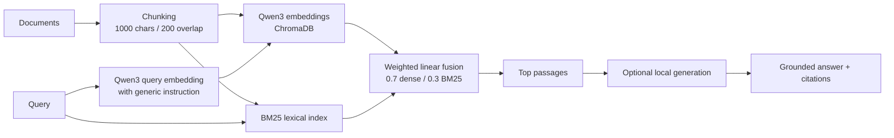

# Retrieval System

Local-first RAG retrieval engine for finding reliable evidence for LLMs and agents. It combines Qwen3 semantic retrieval with BM25 lexical matching, then exposes grounded passages and citations through a CLI, FastAPI, or Gradio UI.

[](https://github.com/ihnatenko-oleksii/Retrieval-System/actions/workflows/ci.yml)

## Why it exists

RAG systems fail when retrieval fails. Dense semantic search handles paraphrases well; lexical BM25 search protects exact technical terms, identifiers, and codes. This project combines both and evaluates retrieval empirically instead of treating generation quality as a substitute for evidence quality.

## Results

Final benchmark-v4 results, evaluated after the architecture was frozen:

| System | Recall@5 | MRR | nDCG |
|---|---:|---:|---:|
| Original E5 dense | 0.784 | 0.630 | 0.636 |
| Qwen3 hybrid | 0.936 | 0.812 | 0.808 |

The validated hybrid achieved a **27.0% relative improvement in nDCG**, **29.0% relative improvement in MRR**, and **19.4% relative improvement in Recall@5** over the dense E5 baseline. These are retrieval metrics, not answer-accuracy percentages.

The final comparison used a separate 50-document Python standard-library corpus, 125 held-out span-labeled questions, a frozen architecture, and paired bootstrap uncertainty. See the [full final methodology and confidence intervals](docs/retrieval_results/phase5_final_results.md) and the [sealed benchmark manifest](docs/benchmark_v4/manifest.json).

## Validated retrieval path



The recommended default has no reranking, query rewriting, pseudo-relevance feedback, learned ranking, or Phase 4 cascade. The Qwen instruction is applied to query embeddings only; stored document embeddings remain unprompted. Changing the embedding model or chunking settings requires re-ingestion.

## Capabilities

### Validated default / recommended retrieval

- 15+ document formats, including Markdown, PDF, DOCX, PPTX, CSV, JSON, and source code
- Qwen3 dense retrieval plus BM25 lexical retrieval
- Stable chunk metadata and grounded source citations
- Local persistent ChromaDB and BM25 indexes
- CLI, FastAPI, and Gradio interfaces
- Retrieval evaluation with Recall@K, Precision@K, MRR, graded nDCG, and bootstrap analysis

### Optional experimental features

Cross-encoder or Qwen reranking, query rewriting and expansion, pseudo-relevance feedback, adaptive routing, diversity selection, and learning-to-rank remain implemented as opt-in experiments. They were evaluated, but the more complex variants did not generalize better than the final simple hybrid path.

## Evaluation

Recall@K measures how much labeled relevant evidence appears in the top K; MRR emphasizes the rank of the first relevant passage. Graded nDCG compares the retrieved ranking with the ideal ordering built from **all** labeled relevant evidence, applies rank discounting, and normalizes the result to 0–1.

The [evaluation index](docs/evaluation.md) explains historical benchmarks, development data, the final independent validation, and reproduction commands. The [architecture guide](docs/architecture.md) covers request flow and metric implementation.

## Quick start

Requirements: Python 3.12+, [uv](https://docs.astral.sh/uv/), and a local Hugging Face cache or network access for the embedding model. Ollama is optional for answer generation.

```bash
uv sync
cp .env.example .env

# Put source documents in ./data, then build the Qwen3 + BM25 indexes.
uv run main.py ingest "./data"

# Retrieval plus optional generation using LLM_MODEL from .env.
uv run main.py ask "What is dependency injection?"

# Other interfaces.
uv run main.py api
uv run main.py ui
```

Retrieval requires `Qwen/Qwen3-Embedding-0.6B`. Generation is separate and requires an optional Ollama-compatible local model; configure it with `LLM_MODEL` (the example uses `qwen3.5:4b-mlx`).

Run the local quality gates with:

```bash
uv run pytest
uv run ruff check .
```

The repository has **193 passing tests** in the offline suite; CI runs Ruff and
the same test suite without downloading model-heavy benchmarks.

## Project documentation

- [docs/usage.md](docs/usage.md) — CLI, API, configuration, and evaluation-file reference
- [docs/architecture.md](docs/architecture.md) — request flow, validated defaults, optional components, and metrics
- [docs/evaluation.md](docs/evaluation.md) — benchmark hierarchy and reproducible evaluation map
- [docs/benchmark.md](docs/benchmark.md) — historical benchmark harness and preserved results
- [docs/workflow.md](docs/workflow.md) — recommended ingest, evaluate, and usage workflow
- [docs/troubleshooting.md](docs/troubleshooting.md) — model, index, and local-runtime troubleshooting
