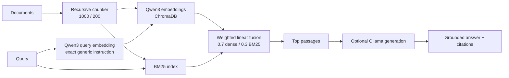

# Architecture

## Project structure

```text
app/
  api/           # FastAPI endpoints
  chunking/      # Chunk splitting logic
  core/          # Config + shared data models
  embeddings/    # Model-aware embedding adapters
  evals/         # Evaluation pipeline
  generation/    # Grounded answer generation
  ingestion/     # File loaders and ingestion pipeline
  retrieval/     # Hybrid retriever and optional experiments
  ui/            # Gradio applications
  vector_store/  # Chroma + BM25 stores
data/             # Put source documents here
storage/          # Persistent indexes
docs/             # Documentation, benchmark corpora, and results
scripts/          # Reproducible evaluation runners
  experiments/    # Historical Phase 3/4/5 research utilities
main.py           # CLI entrypoint
```

## Validated default request flow



The application defaults to `Qwen/Qwen3-Embedding-0.6B`, the generic instruction defined in `app/core/config.py`, fixed 0.7/0.3 dense/BM25 weights, weighted-linear fusion, and 1000/200 character chunking. The instruction is applied to query embeddings only; document embeddings are unprompted. Changing the embedding model or chunking settings requires re-ingestion.

Reranking, query rewriting, query expansion, pseudo-relevance feedback, adaptive routing, diversity selection, and LTR are implemented as optional experimental components. They are disabled in the recommended path.

## Request implementation

1. Documents are loaded with format-specific loaders and split into chunks with stable source metadata (`app/ingestion`, `app/chunking`).
2. Chunks are embedded into ChromaDB and tokenized into a BM25 index (`app/vector_store`).
3. A query is embedded with Qwen3's query-only instruction. The raw query is also sent to BM25.
4. Dense and sparse candidates are independently normalized and combined with fixed 0.7/0.3 weighted-linear fusion. Stable chunk identity prevents duplicate results from collapsing unrelated passages.
5. The top passages are formatted into a grounded prompt with numbered source markers and optionally sent to the configured local Ollama-compatible model (`app/generation`).

## Optional experimental path

The retriever supports per-request `RetrievalConfig` overrides for experiments. These can enable rewriting, expansion, reranking, adaptive routing, PRF, diversity selection, or LTR without mutating global settings. Such settings are useful for controlled development comparisons but are not part of the validated default.

## Evaluation

`app/evals/evaluator.py` evaluates labeled JSONL cases through the retriever and reports:

- **Recall@K** — the fraction of all positively labeled relevant evidence retrieved in the top K.
- **Precision@K** — the fraction of the top K that is relevant.
- **MRR** — the reciprocal rank of the first relevant result.
- **nDCG** — graded, rank-discounted retrieval quality normalized against the ideal ordering constructed from all labeled relevant evidence, not only evidence retrieved by the system. The result is normalized to 0–1.
- **keyword_hit_rate** — an optional answer-generation metric requiring the configured local LLM.

Retrieval metrics do not require an LLM; `Evaluator(..., skip_generation=True)` measures retrieval only. The benchmark hierarchy and final result are documented in [docs/evaluation.md](evaluation.md).

## Configuration boundaries

Global defaults live in the `pydantic-settings` model in `app/core/config.py`, loaded from `.env`. `RetrievalConfig` in `app/core/runtime_config.py` mirrors the request-level knobs so the API, Gradio UI, and evaluation harness can override a trial without mutating process-wide settings.

FastAPI builds its `VectorStore`, `BM25Store`, and `Retriever` lazily through cached dependency providers. Importing the API module therefore does not trigger model loading, and tests can replace dependencies with fakes.
