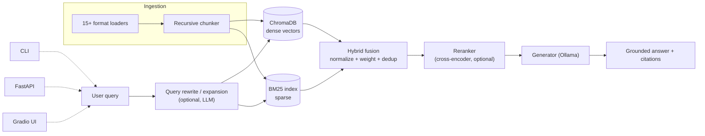

# Architecture

## Project structure

```text
app/
  api/           # FastAPI endpoints
  chunking/      # Chunk splitting logic
  core/          # Config + shared data models
  embeddings/    # Embedding adapters
  evals/         # Evaluation pipeline
  generation/    # LLM prompting and answer generation
  ingestion/     # File loaders and ingestion pipeline
  retrieval/     # Retriever, rewriter, reranker
  ui/            # Gradio applications
  vector_store/  # Chroma + BM25 stores
data/            # Put your source documents here
storage/         # Persistent indexes (Chroma + BM25)
docs/            # Extended docs, benchmark corpus and results
scripts/         # Benchmark runner
main.py          # CLI entrypoint
```

## Request flow



1. Documents are loaded and chunked with metadata (`app/ingestion`, `app/chunking`).
2. Chunks are embedded and stored in ChromaDB (dense) and tokenized into a
   BM25 index (sparse) — `app/vector_store`.
3. At query time, the query is optionally rewritten (standalone-ified from
   chat history, or LLM-clarified) and optionally expanded into a few
   alternate phrasings — `app/retrieval/rewriter.py`.
4. Dense and sparse candidates are retrieved for every query variant.
5. Each side is independently min-max normalized, then fused with
   configurable weights (default 0.7 dense / 0.3 sparse); acronym-style
   queries are automatically re-weighted toward the lexical side. Chunks are
   deduplicated by a stable `(file_path, chunk_index)` identity rather than
   raw text, so two different chunks that happen to share similar wording
   aren't silently merged — `app/retrieval/retriever.py`.
6. The fused candidates are optionally reranked with a cross-encoder for a
   sharper final ordering — `app/retrieval/reranker.py`.
7. The top chunks are formatted into a grounded prompt with numbered source
   markers and sent to the local LLM via Ollama; the response is returned
   together with per-chunk citations (source file, chunk index, score) —
   `app/generation/generator.py`.

## Evaluation

`app/evals/evaluator.py` runs a labeled JSONL file through the same
retriever + generator path used at query time and reports:

- **recall@k** / **precision@k** — whether/how much of the top-k came from the expected source.
- **mrr** — reciprocal rank of the first relevant chunk.
- **ndcg** — rank-discounted score against the best achievable ordering of
  the relevant chunks actually found (not a fixed constant — a case with
  two relevant chunks has a different ideal DCG than a case with one).
- **keyword_hit_rate** — fraction of expected keywords present in the generated answer.

Retrieval metrics (recall/precision/mrr/ndcg) don't require an LLM;
`Evaluator(..., skip_generation=True)` skips generation entirely so retrieval
quality can be measured without Ollama running — this is what
[`scripts/benchmark.py`](../scripts/benchmark.py) uses for the
`--skip-generation` mode. See [docs/benchmark.md](benchmark.md) for a
reproducible run comparing dense-only, hybrid, and hybrid+reranked
retrieval.

## Configuration boundaries

Global defaults live in one `pydantic-settings` model (`app/core/config.py`),
loaded from `.env`. A `RetrievalConfig` dataclass
(`app/core/runtime_config.py`) mirrors those fields and lets any caller — the
Gradio chat UI, the FastAPI `/ask` endpoint, or the tuning sweep — override
them for a single request or trial without mutating global state shared
across concurrent requests.

The FastAPI app builds its `VectorStore`/`BM25Store`/`Retriever` singletons
lazily via `Depends(...)`-injected, `lru_cache`d providers
(`app/api/endpoints.py`) rather than at import time, so importing the module
(e.g. in tests) never triggers an embedding-model download, and tests can
swap in fakes via `app.dependency_overrides`.
